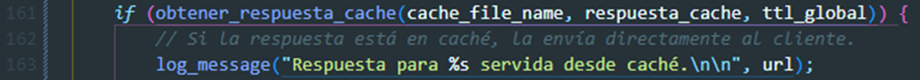

# PROYECTO N°1 - TELEMÁTICA.
## 1. Autores
---
| [<br><sub>Mauricio David Correa Hernández.</sub>](https://github.com/MauricioDCH) | [<br><sub>Mateo Ramirez Rubio</sub>](https://github.com/MateoRamirezRubio1) |
| :----------------------------------------------------------------------------------------------------------------------------------------------------------------------------------------------------------: | :----------------------------------------------------------------------------------------------------------------------------------------------------: |

## 2. Índice
---

[1. AUTORES](#1.-Autores)

[2. ÍNDICE](#2.-Índice)

[3. INTRODUCCIÓN](#3.-Introducción)

[4. FLUJO FUNCIONALIDAD](#4-Flujo-funcionalidad)

[5. FUNCIONALIDAD](#5-Funcionalidad)

[6. DESARROLLO](#6-Desarrollo)

[7. IMPLEMENTACIÓN](#7-Implementación)

[8. RETOS Y SOLUCIONES](#8-Retos-y-soluciones)

[9. ASPECTOS LOGRADOS Y NO LOGRADOS](#9-Aspectos-logrados-y-no-logrados)

[10. USO](#10-Uso)

[11. COMPILACIÓN Y EJECUCIÓN](11.-Compilación-y-ejecución.)

[12. CONCLUSIÓN](#12-Conclusión)

[13. REFERENCIAS](#13-Referencias)

[14. VIDEO](#14-video)

---
## 3. Introducción

En el marco del proyecto Telemática Proyecto N1: Programación en Red, nos sumergiremos en un apasionante viaje hacia el diseño y desarrollo de aplicaciones concurrentes en red. Este proyecto nos ofrece la oportunidad de explorar profundamente la creación de un protocolo de comunicaciones utilizando la API Sockets, con el objetivo de mejorar la interacción entre aplicaciones cliente y servidor.

Nuestro enfoque se centrará en dos componentes cruciales en el entorno de las aplicaciones cliente/servidor: el proxy inverso para HTTP y el balanceador de carga. Estos elementos desempeñan un papel fundamental al actuar como intermediarios que optimizan el flujo de información y distribuyen eficientemente las peticiones entrantes entre múltiples servidores. A través de la implementación de estos componentes, exploraremos cómo podemos mejorar la eficiencia y la escalabilidad de nuestras aplicaciones en red.

Durante el desarrollo de este proyecto, nos sumergiremos en los detalles de los sockets, esos conductos virtuales que permiten la comunicación entre aplicaciones a través de la red. Exploraremos los diferentes tipos de sockets disponibles y aprenderemos a seleccionar el más adecuado para nuestras necesidades específicas.

Además, profundizaremos en el protocolo HTTP, el lenguaje común que utilizan las aplicaciones web para comunicarse entre sí. Analizaremos sus características y funcionalidades, y descubriremos cómo podemos aprovecharlo al máximo para construir soluciones efectivas en nuestro entorno de red.

Nuestro enfoque será eminentemente práctico y orientado a la implementación. A lo largo de este proyecto, trabajaremos en equipo para superar desafíos y alcanzar nuestras metas, adquiriendo habilidades sólidas en programación en red y desarrollando soluciones que puedan tener un impacto tangible en el mundo real.

Así que prepárate para sumergirte en este emocionante viaje hacia el corazón de la programación en red. ¡El futuro de las aplicaciones cliente/servidor te espera, y juntos lo exploraremos y construiremos paso a paso!

---

## 4. Flujo funcionalidad

El siguiente diagrama de flujo muestra como es el flujo de la funcionalidad del proyuecto desde una visión general de este:


---

## 5. Funcionalidad
El proyecto consta de los siguientes componentes:
<br>
<br>
**•	Cliente:**
<br>
Puede realizar peticiones GET, HEAD y POST a servidores HTTP. Dispone de caché local para almacenar y recuperar respuestas con el fin de evitar llamadas innecesarias a la red para los recursos a los que se ha accedido recientemente.
<br>
<br>
**•	Proxy HTTP + Equilibrador de carga:**
<br>
Actúa como intermediario que reenvía las peticiones de los clientes a uno de varios servidores backend (ya sea Apache o externo). Implementa el almacenamiento en caché para una respuesta rápida y el equilibrio de carga para distribuir uniformemente las peticiones de los clientes entre los servidores.
<br>
<br>
**•	Servidores web backend:**
<br>
Una serie de servidores que procesan las peticiones HTTP y devuelven las respuestas. Implementado utilizando software de servidor Apache.


---

## 6. DESARROLLO

**Aplicación proxy:**
<br>
•	Intercepta las peticiones HTTP y las dirige al servidor web apropiado.
<br>
•	Modifica la petición entrante para que se ajuste a la URL relativa y a las especificaciones de la cabecera Host.
<br>
•	Añade una cabecera Via para indicar la presencia de un intermediario en la cadena de peticiones.
<br>
•	Equilibrador de carga: Implementa un algoritmo Round Robin para distribuir las peticiones entrantes entre varios servidores.
<br>
•	Mantiene la persistencia de la sesión para garantizar una experiencia de usuario fluida.
<br>
•	Almacenamiento en caché: Almacena las respuestas de los servidores web en disco para una rápida recuperación en posteriores peticiones.
<br>
•	Implementa TTL (Time-To-Live) para mantener la frescura de las respuestas almacenadas en caché.
<br>
•	Concurrencia: Utiliza subprocesos para gestionar múltiples peticiones simultáneas de clientes, lo que permite al servidor funcionar con eficacia bajo carga.
<br>
<br>
**Aplicación cliente:**
<br>
•	El cliente puede realizar tres tipos de peticiones HTTP: GET, HEAD y POST, para recuperar o enviar datos al servidor.
<br>
•	Incluye un sistema de caché local para almacenar las respuestas, optimizando el uso de la red y mejorando los tiempos de respuesta para peticiones repetidas.
<br>
•	Admite un comando para borrar la caché (flush), lo que permite solicitar datos nuevos al servidor.
<br>
•	Al realizar peticiones, el cliente comprueba primero la caché antes de enviar la petición al servidor para determinar si hay disponible una respuesta reciente.
<br>
•	El cliente registra todas las transacciones, incluyendo la fecha, la hora, el tipo de solicitud y las respuestas del servidor, en un archivo de registro especificado en tiempo de ejecución.

---

## 7. Implementación

### **Aplicación proxy:**

**•	Lógica del proxy y el equilibrador de carga:**
<br>
El servidor proxy HTTP y el equilibrador de carga están escritos en C, aprovechando la potencia de los sockets Unix para gestionar las peticiones HTTP. Nuestro enfoque consiste en analizar directamente el protocolo HTTP, manipular las cabeceras e implementar un sistema de caché basado en MD5 para reducir la latencia y la carga del servidor.
<br>
<br>
**•	Análisis de peticiones:**
<br>
El mecanismo de gestión de peticiones está diseñado para analizar las peticiones HTTP entrantes. Aísla el método, el URL y la versión del protocolo, lo que permite al proxy procesar y redirigir la petición de acuerdo con el algoritmo de equilibrio de carga.
<br>

<br>
<br>
**•	Equilibrio de carga:**
<br>
Empleamos un método de programación Round Robin para distribuir la carga uniformemente entre los servidores disponibles. Esto se consigue manteniendo un índice actual y rotando a través de una matriz de estructuras de servidores en cada solicitud entrante.
<br>

<br>
<br>
**•	 Mecanismo de caché:**
<br>
La caché utiliza hashing MD5 para crear claves únicas para cada solicitud, que luego se utilizan para almacenar y recuperar respuestas del servidor. Cada archivo de caché comienza con una marca de tiempo, seguida del contenido de la respuesta HTTP.
<br>

<br>

<br>
Cuando es una petición nueva que no se encuentra en el caché:

<br>
Así mismo cada ciertos minutos se hace un barrido en el directorio donde se encuentra todo el caché para eliminar los archivos de caché que ya tengan vencido el TTL y así no queden gastando espacio en memoria, esto hecho con hilos para no afectar el funcionamiento actual del servidor.
<br>

<br>
**•	Modelo de concurrencia:**
<br>
La aplicación utiliza hilos POSIX (pthreads) para manejar conexiones concurrentes. Cada solicitud del cliente genera un nuevo hilo, lo que garantiza que el proxy pueda gestionar varias conexiones simultáneas sin bloquearse.

<br>
<br>
### **Aplicación cliente:**

**•	Lógica de la aplicación cliente:**
<br>
Una sesión típica implica que el cliente cree un socket, se conecte al servidor, envíe una petición HTTP, reciba la respuesta, opcionalmente la almacene en caché, y luego cierre la conexión.
La caché local del cliente utiliza hashes MD5 de las URL para indexar y recuperar eficazmente las respuestas almacenadas.
El mecanismo de registro garantiza que todas las acciones queden registradas, lo que resulta crucial para depurar y supervisar las operaciones del cliente.
<br>
<br>
**•	Gestión de la caché**
<br>
El sistema de caché ahorra ancho de banda y reduce la latencia al evitar que se vuelvan a buscar recursos que se han obtenido recientemente.
El cliente puede invalidar toda su caché con el comando flush, lo que garantiza que no se utilicen datos obsoletos en solicitudes posteriores.
<br>
<br>
**•	Guardado de documentos:**
<br>
Al momento de consultar cualquier recurso web vía HTTP (ya sea documentos html, txt, pdf, docx, ppt, xls; imagenes jpg, png; o videos mpeg, mov; etc), la aplicación cliente descarga y almacena el recurso en el directorio local.

---

## 8. Retos y soluciones

**•	Gestión de la memoria:**
<br>
Las versiones iniciales del proyecto se enfrentaban a fugas de memoria debido a la asignación dinámica de memoria sin la adecuada liberación. Utilizando herramientas como Valgrind, identificamos y solucionamos estas fugas, asegurándonos de que todas las llamadas a malloc tuvieran sus correspondientes llamadas a free.
<br>
<br>
**•	Sincronización de hilos:**
<br>
La gestión de varios subprocesos que accedían a recursos compartidos, como la caché, provocaba condiciones de carrera. Introdujimos bloqueos mutex para garantizar la seguridad de los subprocesos en las operaciones con datos compartidos, evitando la corrupción y asegurando la integridad de los datos.
<br>
<br>
**•	Análisis de casos extremos:**
<br>
El tratamiento de varios casos extremos en el análisis sintáctico de peticiones HTTP fue todo un reto. Mediante pruebas rigurosas con distintos formatos de petición y la aplicación de reglas de validación estrictas, mejoramos la solidez del analizador sintáctico de peticiones.

---

## 9. Aspectos logrados y no logrados

**Logros:**
<br>
•	Implementación satisfactoria de la capacidad del cliente para gestionar peticiones HTTP y almacenamiento local en caché.
<br>
•	Comunicación fiable con el proxy del servidor, con funciones sólidas de gestión de errores y registro.
<br>
•	Se hizo un uso eficiente de la caché local para reducir el tráfico de red y la carga en el servidor.
<br>
•	El Servidor Proxy HTTP y el Equilibrador de Carga gestionan con éxito las peticiones básicas HTTP GET y HEAD
<br>
•	Respuestas de baja latencia gracias a un eficiente sistema de caché.
<br>
•	Distribución uniforme de la carga del servidor gracias al algoritmo Round Robin.
<br>
•	Manejo robusto de conexiones simultáneas de clientes.

**Limitaciones:**
<br>
•	Actualmente, el servidor sólo soporta HTTP/1.1. Futuras iteraciones podrían incluir soporte para HTTP/2.
<br>
•	La estrategia actual de equilibrio de carga no tiene en cuenta la salud del servidor ni los tiempos de respuesta.
<br>
•	Actualmente, el cliente no admite la validación automática de la caché basada en TTL, lo que podría optimizar aún más la eficiencia de la red.
<br>
•	No se proporciona una interfaz gráfica de usuario (GUI), lo que limita al cliente a interacciones de línea de comandos.

---

## 10. Uso

### Instalaciones previas.

Para realizar las actualizaciones en cada servidor, proxy y si es necesario el cliente.

```bash
sudo apt update
sudo apt upgrade
```

#### En los servidores.
```bash
sudo apt-get install apache2
sudo systemctl start apache2
```


#### En el proxy y cliente.
```bash
sudo apt install build-essential
sudo apt-get install libssl-dev
```
## 11. Compilación y ejecución.

### Proxy
Para realizar la compilación y ejecución del proxy

Compilación.
```bash
gcc -c cache/manejoCache.c -o cache/manejoCache.o
gcc -c proxy_server.c -o proxy_server.o -Icache
gcc -o proxy_server proxy_server.o cache/manejoCache.o -lpthread -lcrypto
```
Ejecución.
```bash
./proxy_server 8080 logProxyServer.log
```
### Cliente
Para realizar la compilación y ejecución del cliente

Compilación.
```bash
gcc -c cache/manejoCacheClient.c -o cache/manejoCacheClient.o
gcc -c final_client.c -o final_client.o -Icache
gcc -o final_client final_client.o cache/manejoCacheClient.o -lcrypto
```
Ejecución (Varios ejemplos).
```bash
./final_client logClient.log api.ejemplo.com:80/
./final_client logClient.log 3.219.115.240:80/
./final_client logClient.log 34.193.175.4:80/
./final_client logClient.log 34.198.37.66:80/
./final_client logClient.log 34.198.37.66:80/img/2017-12-19-19-22-29.jpg
```

---

## 12. CONCLUSIÓN.

El proyecto demuestra el éxito de la implementación de una aplicación de red con una caché del lado del cliente, un servidor proxy multihilo capaz de equilibrar la carga y almacenar en caché, y servidores web backend que procesan las peticiones. Aunque la aplicación cumple sus objetivos básicos, hay margen para incorporar comunicaciones seguras y estrategias de equilibrio de carga más inteligentes.

---

## 13. Referencias.

[1. datatracker.ietf.org](https://datatracker.ietf.org/doc/html/rfc7230)

[2. www.openssl.org](https://www.openssl.org/docs/manmaster/man3/MD5.html)

[3. www.tutorialspoint.com](https://www.tutorialspoint.com/cprogramming/c_file_io.htm)

[4. en.wikipedia.org](https://en.wikipedia.org/wiki/Proxy_server)

[5. beej.us/guide/bgnet/](https://beej.us/guide/bgnet/)

[6. beej.us/guide/bgnet/pdf/bgnet_usl_c_1.pdf](https://beej.us/guide/bgnet/pdf/bgnet_usl_c_1.pdf)

[7. datatracker.ietf.org](https://datatracker.ietf.org/doc/html/rfc2616#section-9)

[8. www.geeksforgeeks.org](https://www.geeksforgeeks.org/tcp-server-client-implementation-in-c/)

---
## 14. Video.
En esta sección se encuentra el link del video de la entrega que es requerido.

[Video requerido de entrega.](https://eafit-my.sharepoint.com/:v:/g/personal/mdcorreah_eafit_edu_co/EQ3pYOjMWsBDoJU--cmarooBZl5pFl2s384s7qdiviF8UQ?e=gOJJ64)